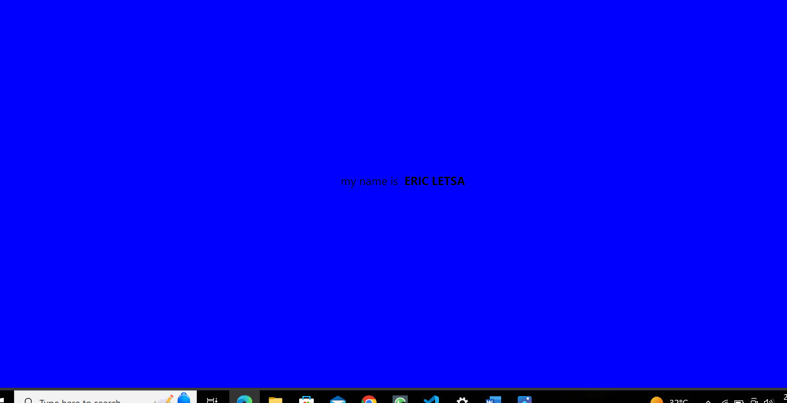

# rn-assignment2-ID-11352899

# MY REACT NATIVE APP

This is a simple React Native app that displays a personalized greeting. It was created using the Expo CLI and a blank template project.

## Features

- Displays a personalized greeting with the user's name
- Customizable background color and text style

## Getting Started

To get started with this app, follow these steps:

1. Clone the repository to your local machine
2. Install the dependencies using npm install or yarn install
3. Start the development server using expo start
4. Scan the QR code with the Expo app on your mobile device or use the web simulator

## Customization

To customize the app, you can edit the App.js file in the src directory. Here are the changes that were made to the default template:

- The background color of the View component was changed to #f5fcff
- The Text component was edited to display "My name is ERIC LETSA"
- The font size of the text was increased to 24
- The name "YourName" was made bold using the <Text style={{fontWeight: 'bold'}}> component

## Screenshot

